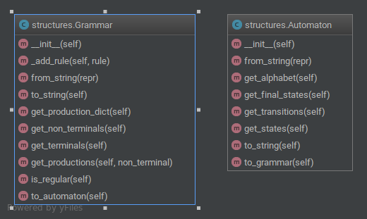

# Documentatie
Programul este implementat ca o utilitara in linie de comanda care primeste ori un automaton ori o gramatica in urmatoarele formate:


### AUTOMAT:
```
q0 q1 a
q0 q1 b
q1 q1 c
q1 q2 z
q0 q1 q2 
```
Pe toate liniile in afar de ultima sunt tranzitii de forma `start end symbol`, iar ultima linie contine un sir de stari finale urmata de cea initiala pe ultima pozitie.

### GRAMATICA:
```
S -> aS | @ | cB
B -> b | c | bB
```
Pe fiecare dintre linii sunt productiile, S iind implicit starea intiala.

Pentru gramatici, programul afiseaza toti terminalii, neterminali, productiile fiecarui neterminal si daca e sau nu regulara. Daca e regulara, se avisa si automatul corespondent.

Pentru automate, se vor afisa alfabetul, starile terminale, starea initiala si toate tranzitiile. De asemenea se va afisa gramatica corespondenta.

### CLI
Programul primeste input de la tastatura sau prin pipe dintr-un fisier.
```
[cat file.txt | ]./transformer.py --automaton/--grammar
```

## Diagrama
