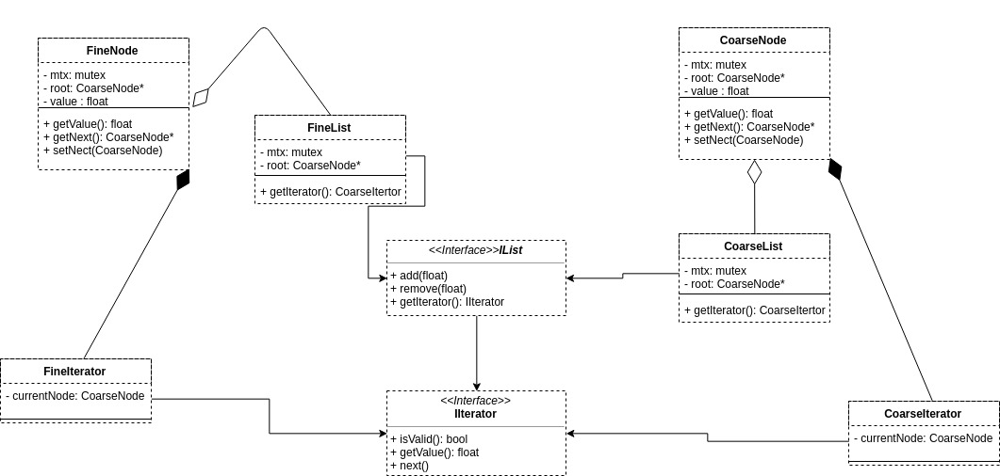

# Laborator 3 - Nichita Utiu 233
## Cerinta
Se va implementa o lista simplu inlantuita sincronizata:
* la nivel de lista(*coarse*)
* la nivel de nod(*fine*)

Lista trebuie sa implementeze urmatoarele oeratii:
* `add(value)`
* `remove(value)`
* `getIterator()`

`getIterator` returneaza un iterator cu interfata standard.

## Proiectare
Pentru sincronizarea la nivel de lista se va folosi un read/write lock care blocheaza exclusiv in cazul operatiilor de scriere si blocheaza shared pentru iteratii.

Pentru sincronizarea la nivel de nod, fiecare nod va contine un mutex care va fi blocat cand va fi folosit
de operatiuni potential distructive(add, remove).
De asemenea, intreaga lista are un read/write lock, care de data asta va fi blocat exclusiv de iterator
si shared de catre celelalte, deoarece nodurile se ocupa ele de sincronizare.

Pentru sincronizarea thread-ului care itereaza se va
folosi o variabila conditionala cu un counter global care tine minte cate thread-uri au terminat procesarea.
E notificat la fiecare incrementare si verifica cu un timeout de 2ms daca conditia e implinita.

## Performanta
**Sistem:** Antergos Linux(Arch Linux) 64bit - Intel® Core™ i7-5500U CPU @ 2.40GHz × 4

### COARSE
|  run | timp(ms) |
| --- | --- | 
| 1 | 6.81746 |
| 2 | 2.24485 |
| 3 | 2.71372 |
| 4 | 1.39386 |
| 5 | 1.34264 |
| 6 | 1.24511 |
| 7 | 1.43782 |
| 8 | 1.40228 |
| 9 | 1.24734 |
| 10 | 1.34171 |

**MEDIA = 2.118679**

### FINE
| run | timp(ms) |
| --- | --- |
| 1 | 1.29223 |
| 2 | 1.5223 |
| 3 | 1.95948 |
| 4 | 1.27518 |
| 5 | 1.43286 |
| 6 | 1.54613 |
| 7 | 1.33278 |
| 8 | 1.46059 |
| 9 | 1.27927 |
| 10 | 1.27696 |

**MEDIA = 1.437778**

### Comparatie
Varianta fine e mai rapida, probabil fiindca se pot executa concomitent mai multe operatii distructive pe lista.
