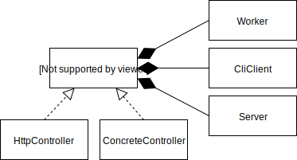

# Lab 4 - Nichita Utiu 233
## Problema
**Magazin**

Un magazin vinde produse pentru care are o descriere caracterizata de urmatoarele atribute:

`(nume, cod_produs, pret_unitar, unit_masura)`

Se pot opera mai multe vanzari simultane!
Permanent se mentine o evidenta actualizata pentru:
* stocurile existente: lista de stocuri; `stoc = (cod_produs, cantitate)`
* vanzarile efectuate: lista de vanzari; `vanzare = (data, produs, cantitate)`
* facturile emise; lista de facturi, `factura = (nume, vanzare, suma_totala)`,
* soldul total (suma existenta in casa).
Periodic sistemul face o verificare a stocurilor prin verificarea corespondentei corecte intre stoc,
* totalitatea produselor vandute (de la ultima verificare pana in prezent), sumele incasate in aceeasi
perioada si soldul total.
Sistemul foloseste un mecanism de tip ‘Thread-Pool’ pentru rezolvarea concurenta a vanzarilor.

## Proiectare
Se va implementa o arhitectura stratificata unde thread-ul de worker, cleintul din linie de comanda si Serverul consuma un serviciu oferit de o interfata comuna de controller care implementeaza operatiunea de `addTransaction` cu garantie de thread safety. Comcurenta se asigura printr-un thread pool.

Pentru a pastra aceasta abstractie si la nivelul de arhitectura client/server, `CliClient` poate fi folosit atat cu un controller concret local, sau cu `HttpControler` care implementeaza un pattern de tip proxy pentru a comunica cu serverul, totodata expunand o interfata consecventa cu cea locala.

`ConcreteController` de asemena porneste in fundal un thread care log-eaza starea magazinului din 5 in 5 secunde pentru verificare. Worker-ul, Client-ul sunt pornite ca threadu-uri si consuma toate acelasi serviciu `IController`.

